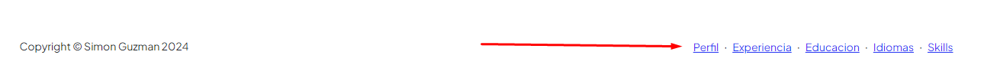

# proyecto-cvs (miPortal.com)

El proyecto es una Web en donde cada usuario puede armar su curriculo u hoja de vida y tener un link el cual puede compartir para que otros puedan verlo.

**Esta primera entrega sólo incluye la opcion de poder llenar un sólo perfil y visualizar la hoja de vida. Se manejaron una cantidad de datos estandar para cumplir con las especificaciones de esta entrega.**

En la entrega final se solicitaran la totalidad de los datos y se harán más validaciones. Tambien se incluirá la posibilidad de que sea multi usuario, es decir, que se puedan registrar muchos y cada uno llenar su hoja de vida. Adicionalmente habrá una vista en donde se pueden buscar profesionales de distintas áreas.

## Puntos importantes para la revisión
- **Url Principal:** http://127.0.0.1:8000/AppCurriculum/

- **Menú Principal:** El menú principal te permitirá navegar por la hoja de vida.

- **Menú de Administracion** Este menú se encuentra en la parete inferior de la página y estan los enlaces para la administración de los modelos.

- **Modelos** Los modelos creados son:
    - Usuario: se utilizará para manejare los usuarios del sistema en la entrega final.
    - DataUsuario: Se utiliza para manejar los datos del perfil de cada usuario.
    - ExperienciaLaboral: Se utiliza para guardar la experiencia laboral del usuario. (En el caso del proyecto final guardará la de todos los usuarios).
    - Educacion: Se utiliza para guardar los estudios del usuario. (En el caso del proyecto final guardará la de todos los usuarios).

    - Idioma: Se utiliza para guardar los idiomas manejados por el usuario. (En el caso del proyecto final guardará la de todos los usuarios).

     - Skills: Se utiliza para guardar las habilidades manejadas por el usuario. (En el caso del proyecto final guardará la de todos los usuarios).

## ¿Que se puede hacer?

Como se comentó anteriormente en esta entrega solo se puede configurar un usuario. Desde el menu inferior (está allí solo para esta entrega) se puede ingresar a la administrración del contenido.

Para el modelo DataUsuario (opcion perfil) solo se está trabajando con un registro. Al cargar el formulario, este estará cargado sólo con el primer user que esta cargado. Y se podrán modificar esos datos. A este no se le colocó búsqueda porque no tiene sentido buscar si es un sólo registro.

Para el resto de los modelos si se puede agregar nuevos registros, buscar registros y se muestra un listado de los registros guardados. A todos se puede ingresar por el menu de administrración en la parte inferior.

Probablemente esas pantallas se van a refactorizar para la entrega final para agregar el modificar y eliminar.

